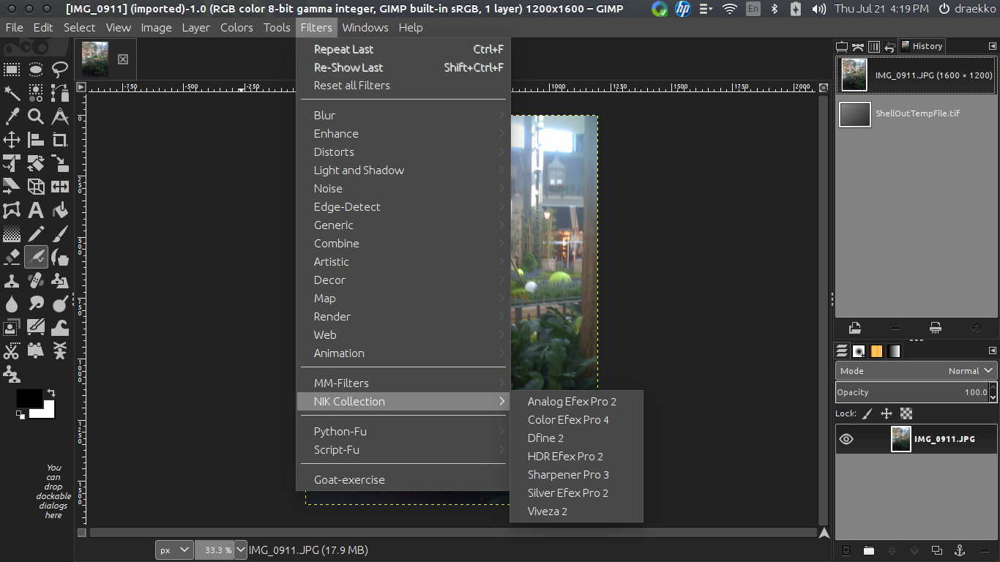
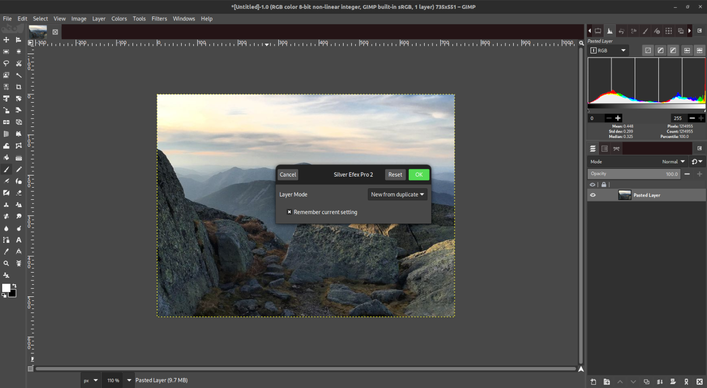
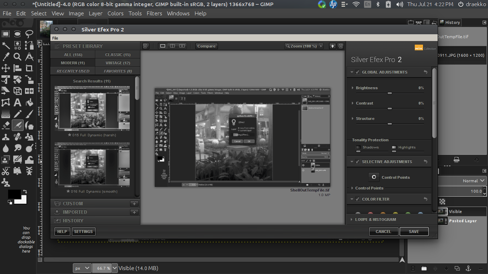

Nik Collection for GIMP v2.10.xx & v2.99.xx
===

Installation script to install Nik Collection v1.2.11 for use with GIMP (2.10.30, 2.99, or versions above those) and as a standalone app. 

Screenshots:

### Notes:

* Tested on Ubuntu 22.04 with Wine Staging v7.11 using Nik Collection v1.2.11, and GIMP v2.99 (from git).
* You can use an already downloadeded nikcollection-1.2.11.exe file with the installation script but make sure to use the absolute path when doing so.
* Depending on your system specs the plugins can take some time to start as they are launched through wine.
