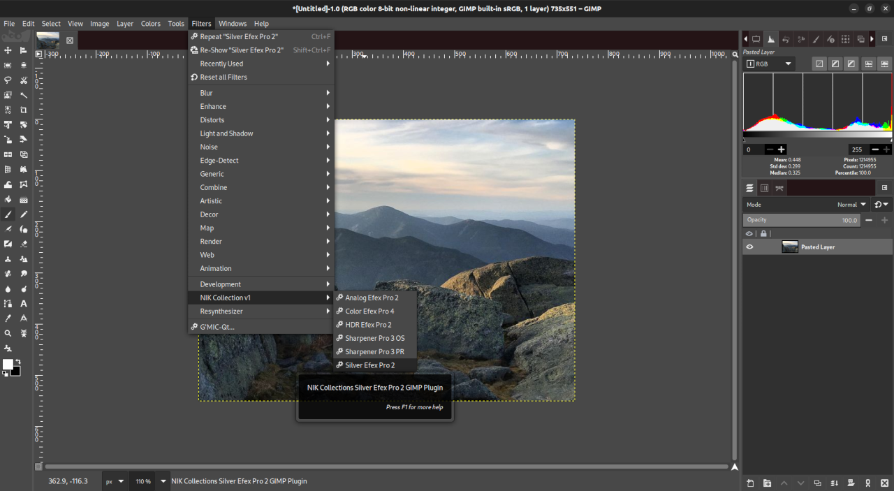

Nik Collection on GIMP
===

Installation script to install Nik Collection for use with GIMP (2.9 & 2.10) and as a standalone app. 

Screenshots:

### Notes:

* Tested on Ubuntu 16.04, 17.04 with Wine Staging v1.9.14 through version 2.12 using Nik Collection v1.2.11, and GIMP v2.9.5 & v2.9.6 (from git).
* Make sure that Windows OS version set for wine is set to XP.
* Depending on your system specs the apps can take some time to start.

### Issues:

* GIMP will complain with the message 'Incompatible type for "RichTIFFIPTC"; tag ignored' after using some of the apps. If you click ok, the error will go away and everything will work. Note that if you have the convert utility program installed from the imagemagick package those warnings will disappear.

### Credits:

* Initial scripts and information was had from Erico Porto at https://github.com/ericoporto/NikInGimp (his version required PlayOnLinux, if you prefer it rather than using standard wine or wine staging these plugins do then definitely give it a try).

